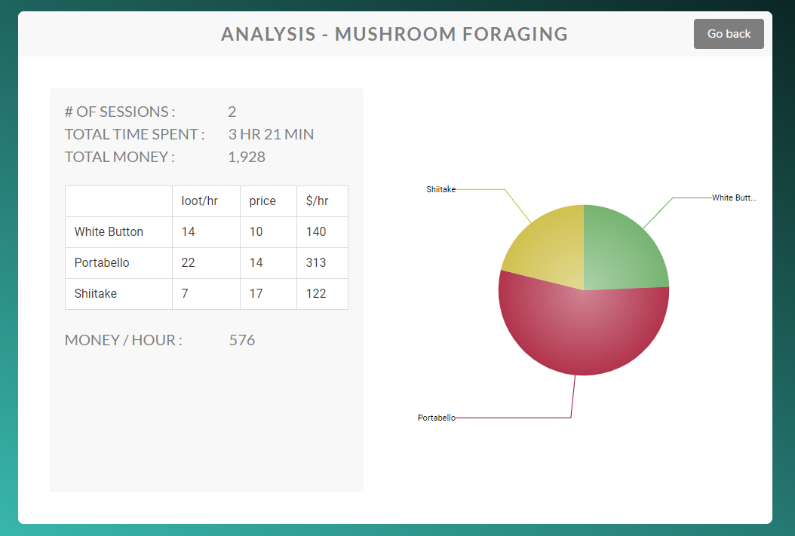
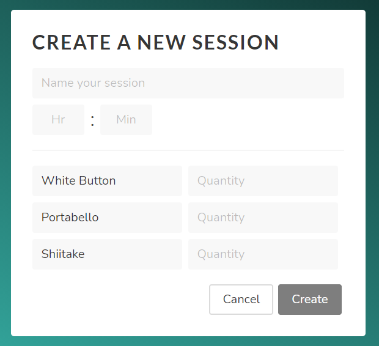

# BDO Activity Tracker

#### A simple application for you to record your grinding/lifeskill sessions and find out your gains!

#### Screenshots: 

## How to install

> run `npm install` in both the **api** and **frontend** folders to install modules

> make sure to install mongoDB, application database default connects to mongodb://localhost:27017

> `nodemon app.js` in the **api** folder
> `ng serve` in the **frontend** folder

> open http://localhost:4200/ in your browser

## Tools Used
#### - Stack: MEAN (MongoDB, Express.js, Angular, Node.js)
#### - Angular Material + Bulma.io for styling

## Improvements
#### - add user authentication, introduce userID into database
